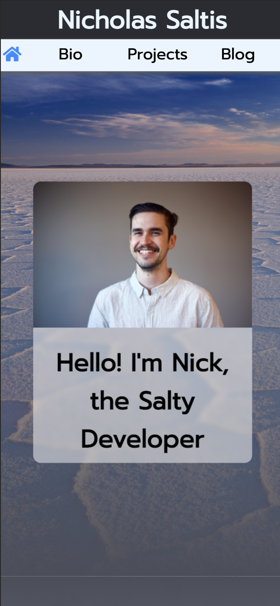
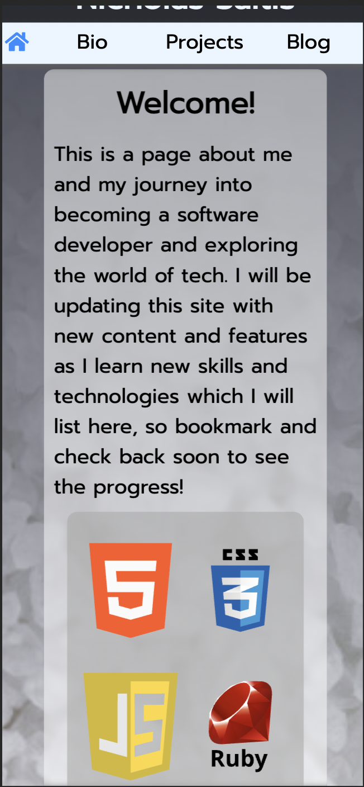
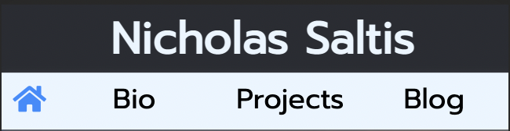
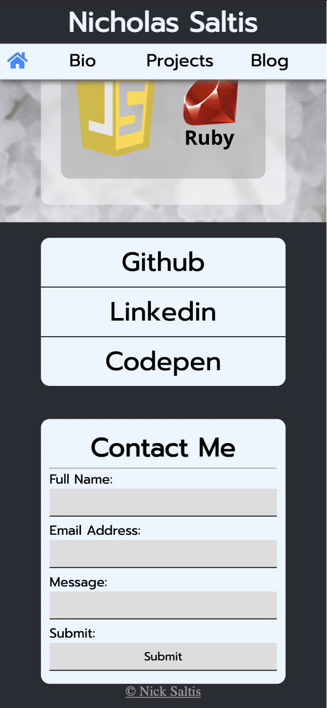
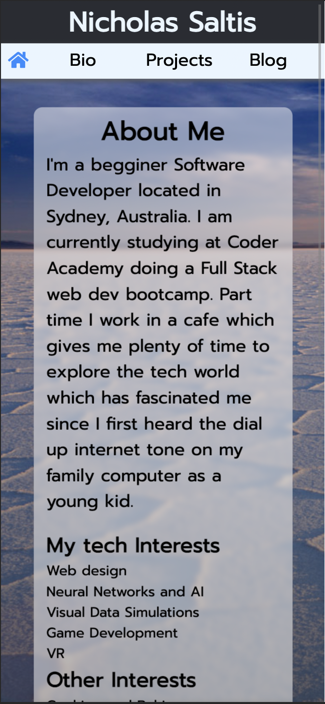
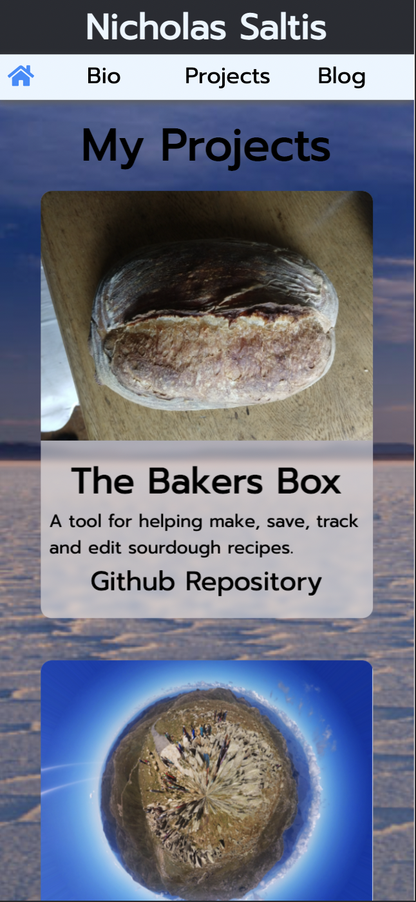
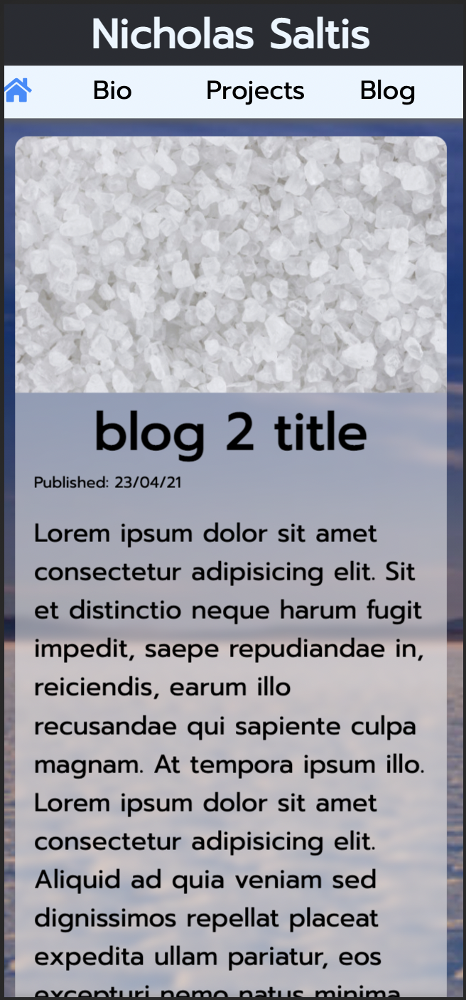
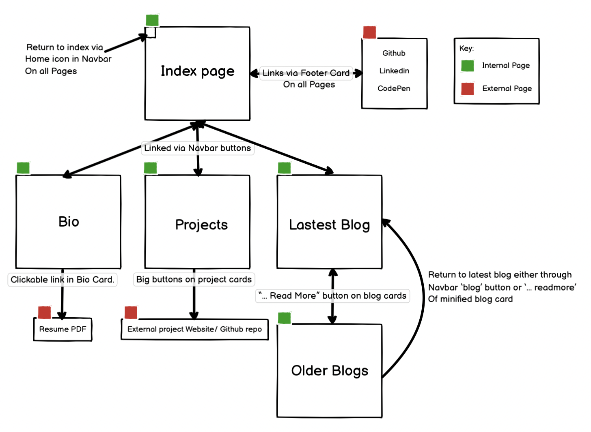

# Nick Saltis Portfolio Website

* [netlify link](https://nicholas-saltis.netlify.app/)

* [Github repository](https://github.com/NicholasSaltis/Portfolio-Website)

## Design Brief.

### Purpose

    To act as a visually engaging self advertising platform as well as a showcase of IT skills and previous projects to attract potential employers who are looking for someone with skills related to the ones displayed on the site. 
    The site also serves to direct visitors to other personal tech or professional pages so that they can explore my past/current work of have other avenues to follow or contact me.

### functionality

* Landing page with profile picture and greeting.

* brief personal/site overview that displays coding languages I work with.

* Sticky Navbar with my name and navigational links to other site pages plus a home icon to return to the index page. 

* footer section with a list of links to other professsional/tech pages (eg. github, linkedin.) plus an email contact form allowing for messages to be sent to me directly.

* Biography page that allows visitors to learn more about my past and current endeavors, interests and professional history plus a link to my resume.

* A project page with a collection of projects that visitors can click on to link them straight to the deployed project or to its github repository.

* A blog page with the latest blog fully displayed with a banner image across the top. Older blogs are truncated into card format with a read more button that links to another page where that blog is fully displayed.

* Fully responsive design using flexbox and relative units that display comfortably on mobile, tablet and desktop.

### SiteMap

### Target Audience

1. Prospective Employers
1. Potential clients if freelancing
1. Fellow Developers
1. Teachers and fellow students at CoderAcademy

### Tech Stack 

* Html 5
* CSS 3
* Git / Github
* Netlify (Continuous deployment)

#### Attributions

* [Ruby Icon](https://iconscout.com/icons/ruby) by [Icon Mafia](https://iconscout.com/contributors/icon-mafia)

* [Html5 Logo Icon](https://iconscout.com/icons/html5) by [Pixel Icons](https://iconscout.com/contributors/pixel-icons)

* [Javascript logo by IconApe](https://iconape.com/javascript-logo-logo-icon-svg-png.html)

* [css3 logo from Wikipedia Commons](https://upload.wikimedia.org/wikipedia/commons/d/d5/CSS3_logo_and_wordmark.svg)
