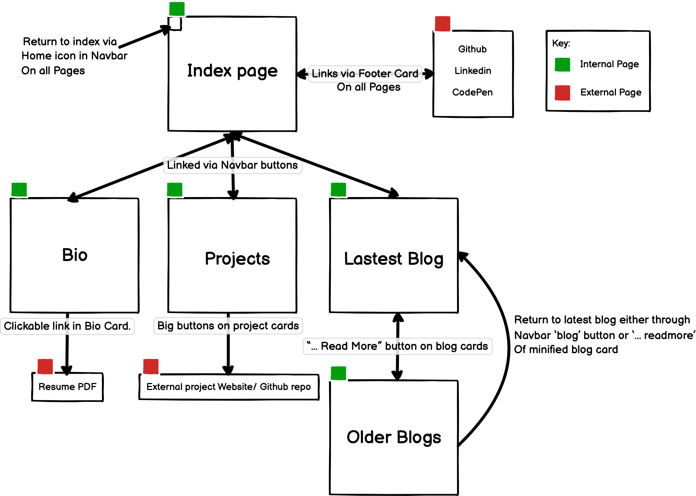

# Nick Saltis Portfolio Website

* netlify link here

* [Github repository](https://github.com/NicholasSaltis/Portfolio-Website)

## Design Brief.

### Purpose

    To act as a visually engaging self advertising platform as well as a showcase of IT skills and previous projects to attract potential employers who are looking for someone with skills related to the ones displayed on the site. 
    The site also serves to direct visitors to other personal tech or professional pages so that they can explore my past/current work of have other avenues to follow or contact me.

### functionality

* 

### SiteMap

### Tech Stack 

* Html 5
* CSS 3
* Git / Github
* Netlify
